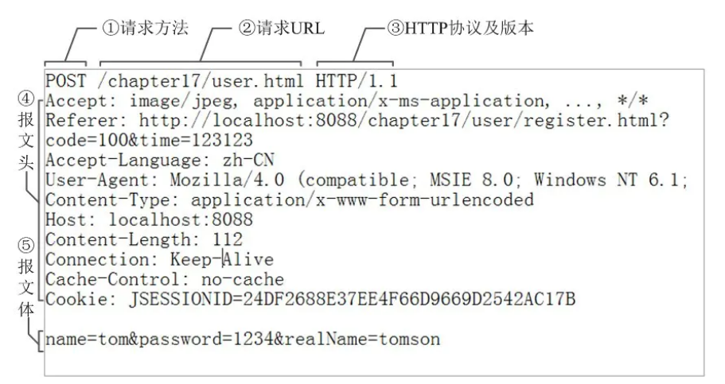
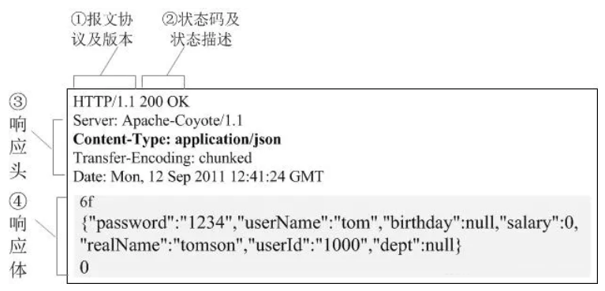
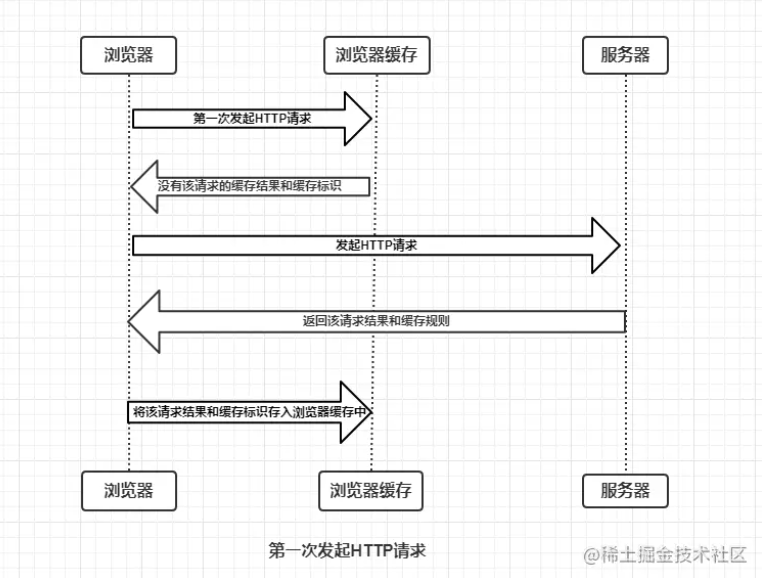
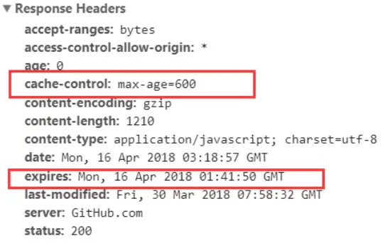
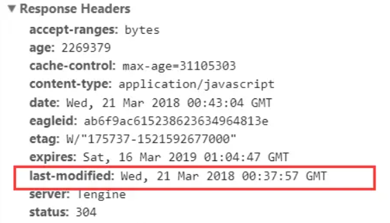
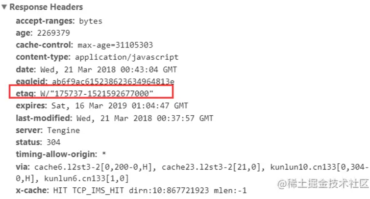
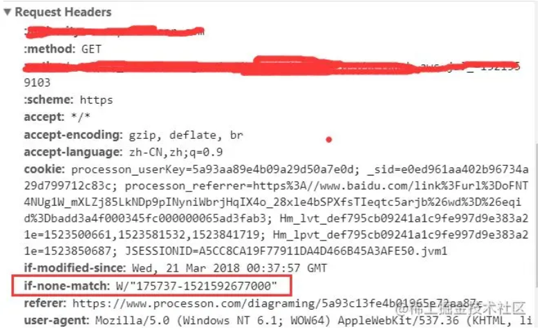

# 浏览器缓存

## 简介

浏览器缓存即 HTTP 缓存机制
- 机制：根据 HTTP 报文的缓存标识进行缓存

> HTTP **请求**报文格式：请求行 - HTTP 请求头(通用信息头、请求头、实体头) - 请求体(POST 请求才有)
>
> 
>
> HTTP **响应**报文格式：状态行 - HTTP 头（通用信息头、响应头、实体头） - 响应体
>
> 
>
> 通用信息头（请求和响应报文都支持的头域）：
>
> - Cache-Control、Connection、Date、Pragma、Transfer-Encoding、Upgrade、Via
>
> 实体头（实体信息的实体头域）
>
> - Allow、Content-Base、Content-Encoding、Content-Language、Content-Length、Content-Location、Content-MD5、Content-Range、Content-Type、Etag、Expires、Last-Modified、extension-header

## 缓存过程分析

浏览器和服务器通信基于应答模式

- 浏览器每次发起请求前都需要查找是否有该请求的结果以及缓存标识
- 浏览器每次拿到结果后都会将结果和缓存标识存入浏览器缓存中

根据是否需要向服务器重新发起HTTP请求将缓存过程分为**强制缓存**和**协商缓存**。

### 强缓存

**暂不分析协商缓存**，强缓存三种情况：

1.不存在该缓存结果和缓存标识，强制缓存失效，则直接向服务器发起请求

2.存在该缓存结果和缓存标识，但该结果已失效，强制缓存失效，则使用协商缓存

3.存在该缓存结果和缓存标识，且该结果尚未失效，强制缓存生效，直接返回该结果

#### 控制字段

- Cache-Control 和 Expires

##### Expires

Expires是HTTP/1.0控制网页缓存的字段

- 值为到期时间，由服务器返回。（即如果客户端的时间小于Expires的值时，直接使用缓存结果。）

> HTTP/1.1，Expire 已经被 Cache-Control 替代
>
> - 原因
>   - Expires 控制缓存的原理是使用客户端的时间与服务端返回的时间做对比，如果客户端与服务端的时间因为某些原因（例如时区不同；客户端和服务端有一方的时间不准确）发生误差，那么强制缓存则会直接失效，则强制缓存的存在则毫无意义

##### Cache-Control

在HTTP/1.1中，Cache-Control是最重要的规则，主要用于控制网页缓存，主要取值为：

- public：所有内容都将被缓存（客户端和代理服务器都可缓存）
- private：所有内容只有客户端可以缓存，Cache-Control的默认取值
- no-cache：客户端缓存内容，但是是否使用缓存则需要经过协商缓存来验证决定
- no-store：所有内容都不会被缓存，即不使用强制缓存，也不使用协商缓存
- max-age=xxx (xxx is numeric)：缓存内容将在xxx秒后失效

> - HTTP响应报文中expires的时间值，是一个绝对值
>
> - HTTP响应报文中Cache-Control为max-age=600，是相对值
>
> 在浏览器中，浏览器会在js和图片等文件解析执行后直接存入内存缓存中，那么当刷新页面时只需直接从内存缓存中读取(from memory cache)；而css文件则会存入硬盘文件中，所以每次渲染页面都需要从硬盘读取缓存(from disk cache)。

### 协商缓存

协商缓存就是强制缓存失效后，浏览器携带缓存标识向服务器发起请求，由服务器根据缓存标识决定是否使用缓存

- 协商缓存生效，返回304，不反悔实体
- 协商缓存失效，返回200和请求结果

#### 控制字段

- Last-Modified / If-Modified-Since和Etag / If-None-Match

##### Last-Modified / If-Modified-Since

Last-Modified

- 服务器响应请求时，返回该资源文件在服务器最后被修改的时间

If-Modified-Since

- 客户端再次发起该请求时，携带上次请求返回的 Last-Modified 值
- 服务器收到该请求，发现请求头含有If-Modified-Since字段，则会根据If-Modified-Since的字段值与该资源在服务器的最后被修改时间做对比，若服务器的资源最后被修改时间大于If-Modified-Since的字段值，则重新返回资源，状态码为200；否则则返回304

##### Etag / If-None-Match

Etag

- 服务器响应请求时，返回当前资源文件的一个唯一标识(由服务器生成)

If-None-Match

- 客户端再次发起该请求时，携带上次请求返回的唯一标识Etag值，通过此字段值告诉服务器该资源上次请求返回的唯一标识值
- 服务器收到该请求后，发现该请求头中含有If-None-Match，则会根据If-None-Match的字段值与该资源在服务器的Etag值做对比，一致则返回304，代表资源无更新，继续使用缓存文件；不一致则重新返回资源文件，状态码为200

> Etag / If-None-Match优先级高于Last-Modified / If-Modified-Since

## 总结

强制缓存优先于协商缓存进行，若强制缓存(Expires和Cache-Control)生效则直接使用缓存，若不生效则进行协商缓存(Last-Modified / If-Modified-Since和Etag / If-None-Match)，协商缓存由服务器决定是否使用缓存，若协商缓存失效，那么代表该请求的缓存失效，重新获取请求结果，再存入浏览器缓存中；生效则返回304，继续使用缓存

## 参考
https://juejin.cn/post/6844903593275817998